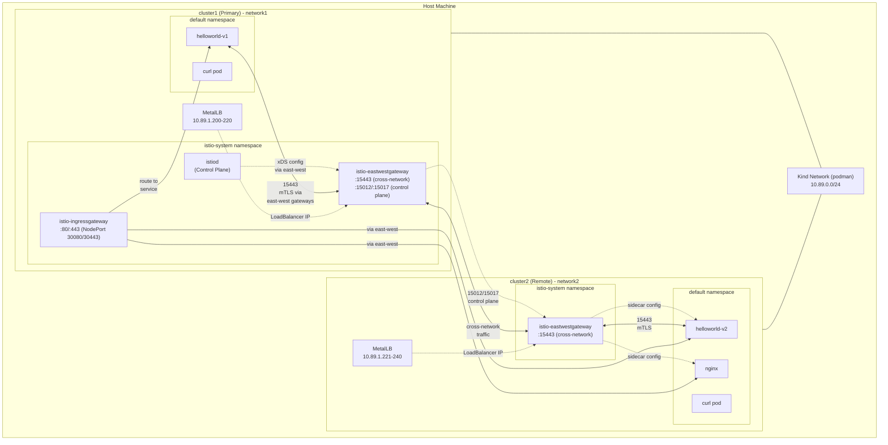
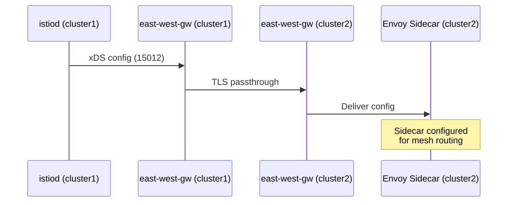
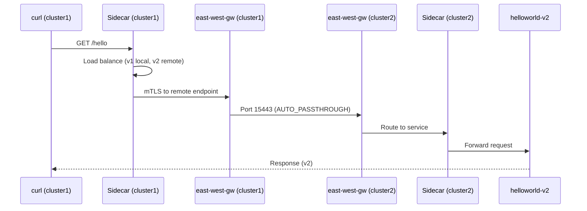
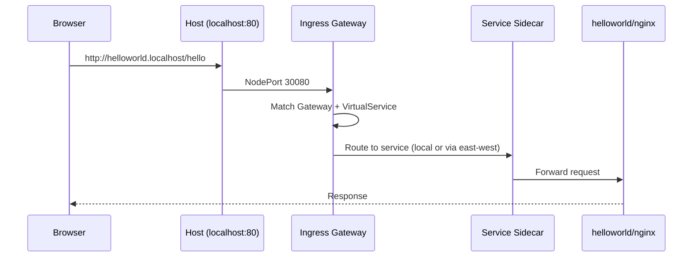

# Istio Multi-Cluster Mesh Architecture

## Overview

This POC demonstrates a **primary-remote** Istio multi-cluster topology using Kind clusters with different networks.

## Traffic Flows

### Control Plane (cluster1 → cluster2)

### Data Plane (cross-cluster request)

### Browser Access (via Ingress Gateway)

## Key Components

| Component | Cluster | Purpose |
|-----------|---------|---------|
| **istiod** | cluster1 | Control plane for both clusters |
| **istio-ingressgateway** | cluster1 | North-south traffic (browser access) |
| **istio-eastwestgateway** | both | Cross-network service traffic + control plane exposure |
| **MetalLB** | both | Provides LoadBalancer IPs for gateways |
| **cross-network-gateway** | both | Gateway resource exposing `*.local` services |
| **istiod-gateway** | cluster1 | Exposes control plane ports (15012, 15017) |

## Network Configuration

- **cluster1**: `network1` - Primary cluster with istiod
- **cluster2**: `network2` - Remote cluster (different network forces east-west routing)

Because the clusters are on different networks, all cross-cluster traffic **must** flow through the east-west gateways using mTLS on port 15443.
